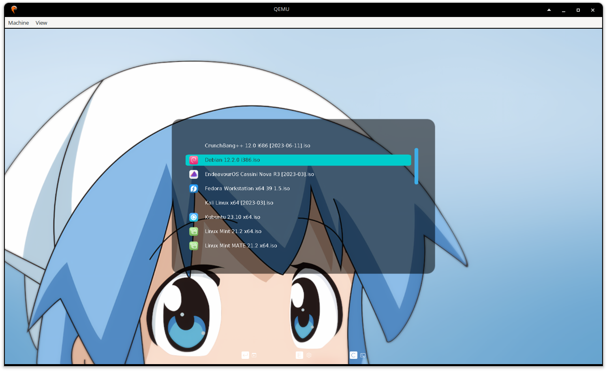

# ventoy-squid-girl

Squid girl GRUB2 theme for [**Ventoy**](https://www.ventoy.net/en/plugin_theme.html).

- Multiple resolution support (1366x768, 1920x1080, 2048x1080
ultrawide, 3840x2160 4K)
- Scrollbar
- Anime squid



## Setup:

1. Initialize a Ventoy multiboot drive. https://github.com/ventoy/ventoy/releases/latest
2. Copy the **`ventoy/`** folder into the root of your ventoy USB.
3. Create an **`iso/`** directory in the root of your ventoy USB
    - Alternatively, change `VTOY_DEFAULT_SEARCH_ROOT` to `"/"` in `ventoy.json`.

For theming, name your images in a way that Ventoy can understand
according to the keys in `ventoy.json`. For example, `MacOS.iso` would be
given an icon, but `Macos.iso` would not.

## TODO:

- Make controls description more comprehensive
    - Currently, only GRUB2-specific controls are shown (Enter,E,C)
    - Iconographic guides for the F1 to F5 keys should also be added

---

<details>
    <summary> <b> behind the scenes </b> </summary>

## How did I make this?

- Docs
    - [Ventoy docs](https://www.ventoy.net/en/plugin_theme.html)  
        - `VTOY_DEFAULT_SEARCH_ROOT` to increase organization
        - `resolution_fit = 1` and `default_file = 0` will
          pattern-match the current monitor resolution when selecting
          `theme.txt`. For example, for 1920x1080:
            - `ventoy/theme/1920x1080/theme.txt` would be matched
            - `ventoy/theme/theme-1920x1080.txt` would be matched
    - Some Russian grub2 docs [[1]](http://wiki.rosalab.ru/en/index.php/Grub2_theme_tutorial) [[2]](http://wiki.rosalab.ru/en/index.php/Grub2_theme_/_reference)
- I studied
[this pull request that adopted a GRUB2 theme into Ventoy](https://github.com/vinceliuice/Graphite-gtk-theme/pull/109).
    - Instead of an item box, I added a transparent GIMP-made box
      directly in the background.
    - If there is some sort of alloc error/magic error on usb boot,
    inspect `ventoy.json`. Ventoy's code fully trusts
    `ventoy.json`, so wrong data in the json will mess things up.
- I looked at the Ventoy docs for Ventoy-specific functions.
- I used the following QEMU command for some testing, straight from the drive.
However, QEMU sometimes didn't update the theme or didn't render the fonts.
    ```sh
    $ sudo qemu-system-x86_64 -boot order=d -drive file=/dev/sdb,format=raw
    -vga virtio # change /dev/sdb as needed
    ```
- I tested resolutions on any monitors I had access to.
    - Some fonts acted peculiar. For example, in 1366x768, the
      font was too large (inconveniently cutting off text) if I set
      DejaVu's font size to 14. However, if I increased font size to
      32 instead of 14, the font size was correctly proportionate.
- I used [Upscayl](https://github.com/upscayl/upscayl)
  to increase the background sharpness for 4K HiDPI monitors, then I
  cropped that new image for 2048x1080 ultrawide.
- I used [this](https://github.com/odiegoduarte/ventoy-themes/releases)
  as reference to fix an issue with my custom scrollbar not appearing.
    - The scrollbar didn't render until I used a menu pixmap.
      For design purposes, the pixmap parts are fully transparent PNGs.

</details>